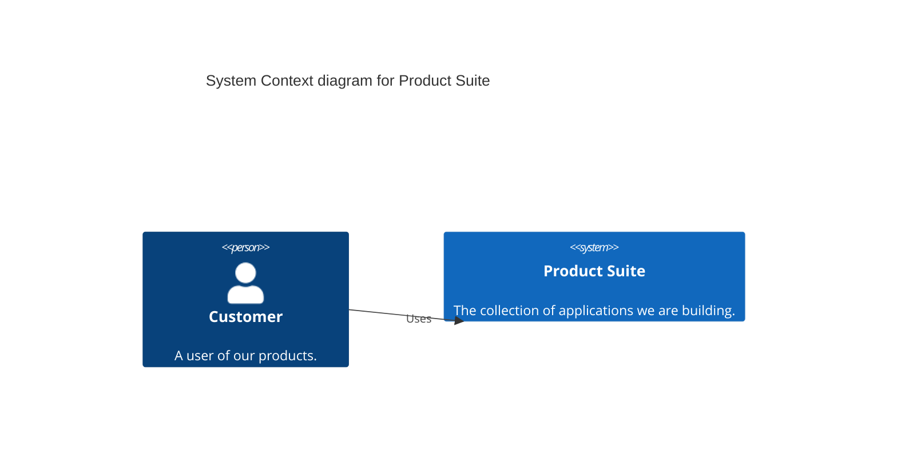

# System Architecture

## Overview
This document describes the high-level architecture consistent across our product suite.

## Diagramming Standard
We use **Mermaid** for all architectural diagrams.

## System Context (C4 Level 1)
<!-- Placeholder for System Context Diagram -->

## Core Principles
1.  **Docs-as-Code**: All documentation lives with the code.
2.  **API-First**: Define interfaces (OpenAPI/GraphQL) before implementation.
3.  **Modular**: Components should be loosely coupled.
## Methodology: The 12-Factor App
We align with the [12-Factor App](https://12factor.net/) methodology to ensure portability and resilience.

1.  **Codebase**: One repo per service, tracked in version control.
2.  **Dependencies**: Explicitly declared (e.g., `pyproject.toml`, `package.json`).
3.  **Config**: Store config in the environment, not code. [INFRASTRUCTURE.md](INFRASTRUCTURE.md#2-configuration)
4.  **Backing Services**: Treat databases/queues as attached resources. [ADR-0008 (Postgres)](docs/decisions/0008-use-postgresql-for-primary-db.md)
5.  **Build, Release, Run**: Strict separation of build stages. [INFRASTRUCTURE.md](INFRASTRUCTURE.md#1-containerization)
6.  **Processes**: Execute as one or more stateless processes. [ADR-0009](docs/decisions/0009-enforce-stateless-services.md)
7.  **Port Binding**: Export services via port binding (FastAPI/Uvicorn). [ADR-0012](docs/decisions/0012-app-execution-standards.md)
8.  **Concurrency**: Scale out via the process model. [ADR-0009](docs/decisions/0009-enforce-stateless-services.md)
9.  **Disposability**: Fast startup and graceful shutdown. [INFRASTRUCTURE.md](INFRASTRUCTURE.md#3-orchestration)
10. **Dev/Prod Parity**: Keep dev, staging, and prod similar. [ADR-0010 (TestContainers)](docs/decisions/0010-comprehensive-testing-strategy.md)
11. **Logs**: Treat logs as event streams (to `stdout`). [ADR-0011](docs/decisions/0011-observability-strategy.md)
12. **Admin Processes**: Run admin/management tasks as one-off processes. [ADR-0012](docs/decisions/0012-app-execution-standards.md)

## Tech Stack (Default)
See [ADR-0006 Use Unified Tech Stack](docs/decisions/0006-use-unified-tech-stack.md)

## Scalability & Data Standards
1.  **Modular Monolith**: Build as a single unit with strict module boundaries. [ADR-0007](docs/decisions/0007-modular-monolith-architecture.md)
2.  **Database**: Postgres is the single source of truth (Relational + Vector). [ADR-0008](docs/decisions/0008-use-postgresql-for-primary-db.md)
3.  **Stateless**: Services must be stateless to allow horizontal scaling. [ADR-0009](docs/decisions/0009-enforce-stateless-services.md)

## Quality Assurance
1.  **Testing Strategy**: Pyramid approach (Unit > Integration > E2E). [ADR-0010](docs/decisions/0010-comprehensive-testing-strategy.md)
2.  **Security Standards**: Authentication and Session Management. [SECURITY.md](SECURITY.md)

## Infrastructure
1.  **Observability**: Logs to Stdout, Metrics via Pull. [ADR-0011](docs/decisions/0011-observability-strategy.md)
